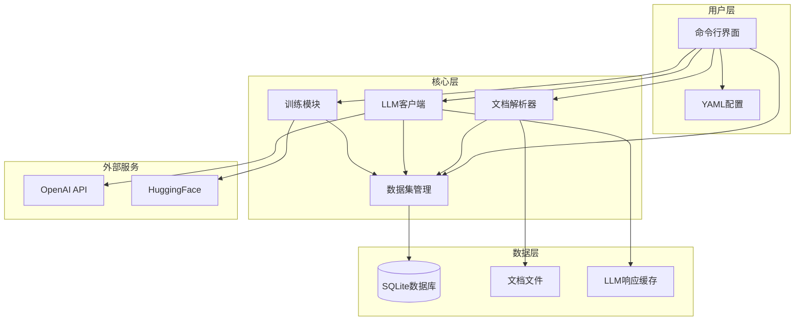
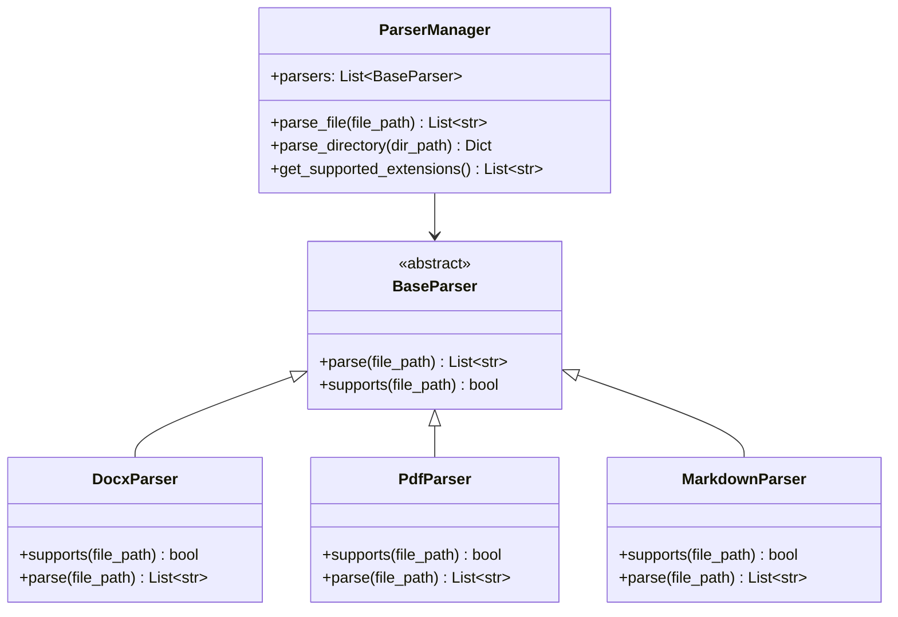
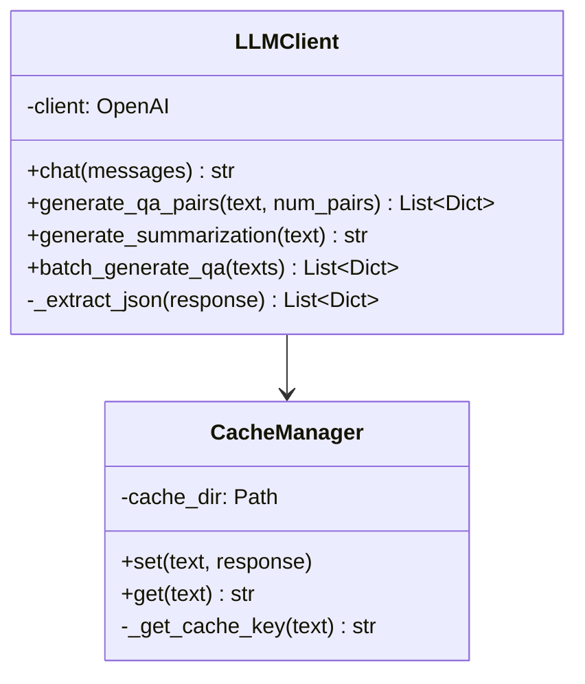
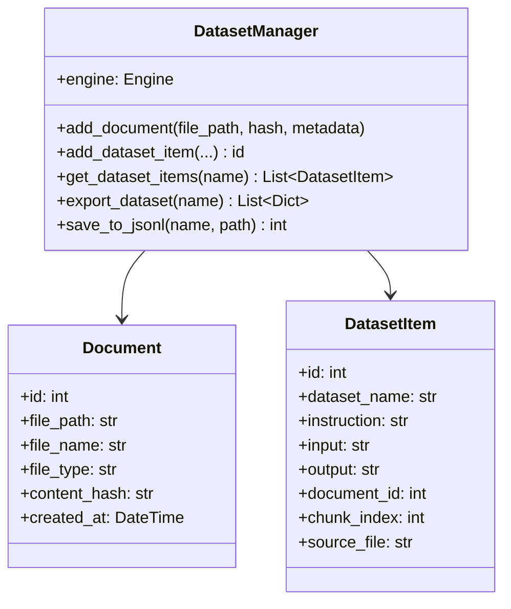
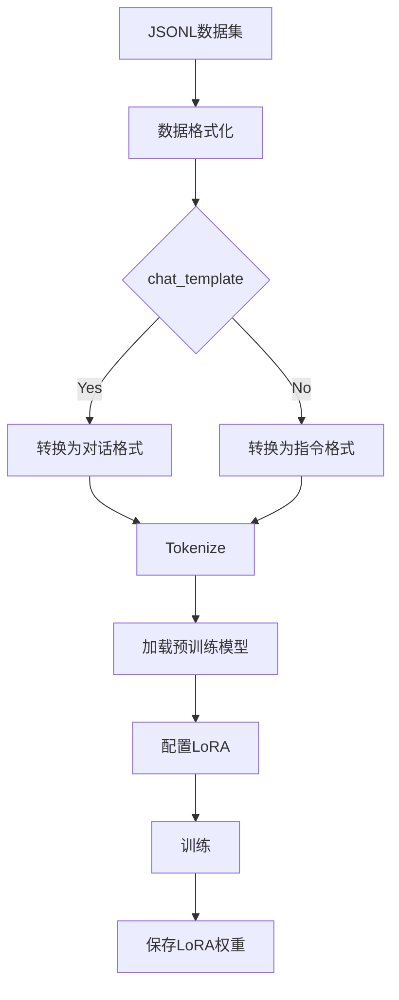
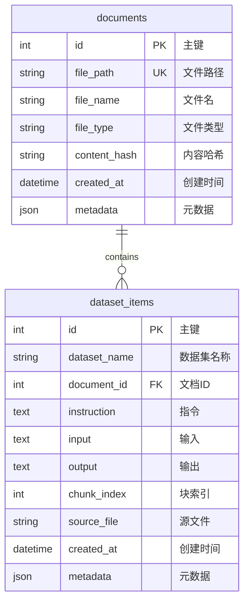

# 📘 设计手册

> model-finetune-tool v0.1.0 设计文档

## 目录

- [1. 项目概述](#1-项目概述)
- [2. 系统架构](#2-系统架构)
- [3. 模块设计](#3-模块设计)
- [4. 数据流设计](#4-数据流设计)
- [5. 数据库设计](#5-数据库设计)
- [6. API设计](#6-api设计)
- [7. 配置说明](#7-配置说明)

---

## 1. 项目概述

### 1.1 项目背景

**model-finetune-tool** 是一个便捷的大语言模型微调工具，旨在帮助用户：

- 📄 **解析多种格式文档** - 支持Word、PDF、Markdown
- 🤖 **自动生成训练数据** - 利用LLM生成高质量QA对
- 💾 **高效数据管理** - SQLite缓存，支持MySQL/PostgreSQL
- ⚡ **简化微调流程** - 基于LoRA的高效微调

### 1.2 设计理念

| 原则 | 描述 |
|------|------|
| **模块化** | 各模块职责单一，可独立使用 |
| **可扩展** | 易于添加新的文档解析器或LLM提供商 |
| **易用性** | CLI交互，配置简单 |
| **可靠性** | 完善的测试覆盖 |

### 1.3 技术栈

```
Python 3.10+
├── pydantic        - 配置管理
├── pyyaml          - YAML配置
├── openai          - LLM调用
├── python-docx     - Word解析
├── pymupdf         - PDF解析
├── sqlalchemy      - 数据库ORM
├── peft            - LoRA微调
├── transformers    - 模型加载
└── click           - CLI框架
```

---

## 2. 系统架构

### 2.1 整体架构图



### 2.2 组件说明

| 组件 | 职责 | 输入 | 输出 |
|------|------|------|------|
| **ParserManager** | 统一文档解析 | 文件路径 | 文本段落列表 |
| **LLMClient** | 调用LLM生成数据 | 文本内容 | QA对/摘要 |
| **DatasetManager** | 数据集CRUD管理 | 数据条目 | 数据库记录 |
| **Trainer** | 模型训练与合并 | 训练数据 | LoRA模型/合并模型 |

---

## 3. 模块设计

### 3.1 文档解析模块 (parser)

#### 3.1.1 类图



#### 3.1.2 解析器策略

| 解析器 | 支持格式 | 依赖库 | 特点 |
|--------|----------|--------|------|
| DocxParser | .docx | python-docx | 提取段落+表格 |
| PdfParser | .pdf | PyMuDF | 按页解析文本 |
| MarkdownParser | .md | 标准库 | 清理格式符号 |

### 3.2 LLM调用模块 (llm)

#### 3.2.1 类图



#### 3.2.2 QA生成流程

```
原始文档文本
    ↓
文本分块处理
    ↓
调用LLM (GPT-3.5/GPT-4)
    ↓
提取JSON响应
    ↓
格式验证
    ↓
QA对列表
```

### 3.3 数据集管理模块 (dataset)

#### 3.3.1 类图



### 3.4 训练模块 (trainer)

#### 3.4.1 训练流程图



---

## 4. 数据流设计

### 4.1 端到端数据流

```
┌─────────────────────────────────────────────────────────────────────┐
│                        数据流处理流程                                │
├─────────────────────────────────────────────────────────────────────┤
│                                                                     │
│  1. 文档输入阶段                                                    │
│     ┌──────────┐    ┌──────────┐    ┌──────────┐                  │
│     │ .docx    │───▶│ Parser   │───▶│ 文本段落 │                  │
│     │ .pdf     │    │ Manager  │    │   列表   │                  │
│     │ .md      │    └──────────┘    └──────────┘                  │
│     └──────────┘                                                  │
│                                                                     │
│  2. 数据生成阶段                                                    │
│     ┌──────────┐    ┌──────────┐    ┌──────────┐                  │
│     │ 文本段落 │───▶│  LLM     │───▶│  QA对    │                  │
│     │   列表   │    │  Client  │    │   列表   │                  │
│     └──────────┘    └──────────┘    └──────────┘                  │
│                                                   │                │
│                                                   ▼                │
│                                              ┌──────────┐         │
│                                              │  SQLite  │         │
│                                              │   数据库  │         │
│                                              └──────────┘         │
│                                                                     │
│  3. 训练阶段                                                        │
│     ┌──────────┐    ┌──────────┐    ┌──────────┐                  │
│     │  SQLite  │───▶│ 导出JSONL│───▶│  格式化  │                  │
│     │   数据库  │    │   文件   │    │   数据   │                  │
│     └──────────┘    └──────────┘    └──────────┘                  │
│                                                   │                │
│                                                   ▼                │
│                                              ┌──────────┐         │
│                                              │  训练   │         │
│                                              │ LoRA模型 │         │
│                                              └──────────┘         │
│                                                                     │
│  4. 输出阶段                                                        │
│     ┌──────────┐    ┌──────────┐    ┌──────────┐                  │
│     │ LoRA权重 │───▶│  模型    │───▶│ 微调后   │                  │
│     │   文件   │    │   合并   │    │   模型   │                  │
│     └──────────┘    └──────────┘    └──────────┘                  │
│                                                                     │
└─────────────────────────────────────────────────────────────────────┘
```

### 4.2 数据格式

#### 4.2.1 训练数据格式

```json
// 单条训练数据
{
  "instruction": "什么是机器学习？",
  "input": "",
  "output": "机器学习是人工智能的一个分支..."
}

// 聊天格式
{
  "messages": [
    {"role": "user", "content": "什么是机器学习？"},
    {"role": "assistant", "content": "机器学习是..."}
  ]
}
```

#### 4.2.2 配置文件格式

```yaml
# 完整配置示例
llm:
  api_key: "${OPENAI_API_KEY}"
  base_url: "https://api.openai.com/v1"
  model: "gpt-3.5-turbo"
  temperature: 0.7
  max_tokens: 2000

database:
  type: "sqlite"
  path: "./data/datasets.db"

datasets:
  input_dir: "./documents"
  chunk_size: 1000
  chunk_overlap: 200

training:
  model_name: "Qwen/Qwen2.5-0.5B-Instruct"
  lora:
    r: 8
    alpha: 16
    dropout: 0.1
    target_modules: ["q_proj", "k_proj", "v_proj", "o_proj"]
  batch_size: 4
  learning_rate: 0.0002
  epochs: 3
```

---

## 5. 数据库设计

### 5.1 ER图



### 5.2 表结构说明

#### 5.2.1 documents 表

| 字段 | 类型 | 约束 | 说明 |
|------|------|------|------|
| id | INTEGER | PRIMARY KEY | 自增主键 |
| file_path | VARCHAR(500) | UNIQUE, NOT NULL | 文件路径 |
| file_name | VARCHAR(255) | NOT NULL | 文件名 |
| file_type | VARCHAR(50) | NOT NULL | 文件类型(.docx/.pdf/.md) |
| content_hash | VARCHAR(64) | NOT NULL | 内容哈希值 |
| created_at | DATETIME | DEFAULT | 创建时间 |
| metadata | JSON | NULL | 额外元数据 |

#### 5.2.2 dataset_items 表

| 字段 | 类型 | 约束 | 说明 |
|------|------|------|------|
| id | INTEGER | PRIMARY KEY | 自增主键 |
| dataset_name | VARCHAR(100) | NOT NULL, INDEX | 数据集名称 |
| document_id | INTEGER | FOREIGN KEY | 关联文档 |
| instruction | TEXT | NOT NULL | 问题/指令 |
| input | TEXT | NULL | 输入内容 |
| output | TEXT | NULL | 输出答案 |
| chunk_index | INTEGER | DEFAULT | 文本块索引 |
| source_file | VARCHAR(500) | NULL | 源文件路径 |
| created_at | DATETIME | DEFAULT | 创建时间 |
| metadata | JSON | NULL | 额外元数据 |

---

## 6. API设计

### 6.1 CLI命令

| 命令 | 参数 | 说明 |
|------|------|------|
| `finetune init` | [--config] | 初始化项目 |
| `finetune parse` | <input_dir> <dataset_name> | 解析文档生成数据集 |
| `finetune export` | <dataset_name> [--format] [--output] | 导出数据集 |
| `finetune stats` | <dataset_name> | 查看数据集统计 |
| `finetune train` | <dataset_name> [--model] [--epochs] | 训练模型 |
| `finetune merge` | <dataset_name> <base_model> | 合并模型 |
| `finetune clear` | <dataset_name> | 清空数据集 |

### 6.2 模块API

#### 6.2.1 ParserManager

```python
class ParserManager:
    def parse_file(self, file_path: str) -> List[str]:
        """解析单个文件
        
        Args:
            file_path: 文件路径
        
        Returns:
            文本段落列表
        """
        pass
    
    def parse_directory(self, dir_path: str, recursive: bool = True) -> Dict[str, List[str]]:
        """解析整个目录
        
        Args:
            dir_path: 目录路径
            recursive: 是否递归处理子目录
        
        Returns:
            文件路径到段落列表的映射
        """
        pass
```

#### 6.2.2 DatasetManager

```python
class DatasetManager:
    def add_document(self, file_path: str, content_hash: str, metadata: Dict = None) -> int:
        """添加文档记录"""
        pass
    
    def add_dataset_item(
        self,
        dataset_name: str,
        instruction: str,
        input_: str = None,
        output: str = None,
        **kwargs
    ) -> int:
        """添加数据集条目"""
        pass
    
    def export_dataset(self, dataset_name: str) -> List[Dict]:
        """导出数据集"""
        pass
```

---

## 7. 配置说明

### 7.1 配置优先级

```
命令行参数 > 环境变量 > 配置文件 > 默认值
```

### 7.2 环境变量

| 变量 | 说明 |
|------|------|
| `OPENAI_API_KEY` | OpenAI API密钥 |
| `OPENAI_BASE_URL` | API基础URL (可选) |

### 7.3 完整配置示例

```yaml
# model-finetune-tool 完整配置

# =====================================
# LLM配置
# =====================================
llm:
  api_key: "${OPENAI_API_KEY}"        # 使用环境变量
  base_url: "https://api.openai.com/v1"
  model: "gpt-3.5-turbo"              # 可选: gpt-4, deepseek-chat等
  temperature: 0.7                     # 生成温度 (0-2)
  max_tokens: 2000                     # 最大生成token数

# =====================================
# 数据库配置
# =====================================
database:
  type: "sqlite"                       # sqlite | mysql | postgresql
  path: "./data/datasets.db"           # SQLite文件路径
  # MySQL配置
  host: "localhost"
  port: 3306
  username: "root"
  password: "your_password"
  database: "model_finetune"
  # PostgreSQL配置
  # host: "localhost"
  # port: 5432
  # username: "postgres"
  # password: "your_password"
  # database: "model_finetune"

# =====================================
# 数据集配置
# =====================================
datasets:
  input_dir: "./documents"             # 文档目录
  output_dir: "./data"                 # 输出目录
  chunk_size: 1000                     # 文本块大小
  chunk_overlap: 200                   # 块重叠大小

# =====================================
# 训练配置
# =====================================
training:
  model_name: "Qwen/Qwen2.5-0.5B-Instruct"  # 模型名称
  lora:
    r: 8                               # LoRA rank
    alpha: 16                          # LoRA alpha
    dropout: 0.1                       # Dropout比例
    target_modules:                    # 目标模块
      - "q_proj"
      - "k_proj"
      - "v_proj"
      - "o_proj"
  batch_size: 4                        # 批次大小
  learning_rate: 0.0002               # 学习率
  epochs: 3                            # 训练轮数
  max_length: 2048                    # 最大序列长度

# =====================================
# 输出配置
# =====================================
output:
  model_dir: "./output"               # 模型输出目录
  checkpoint_dir: "./checkpoints"     # 检查点目录

# =====================================
# Git配置
# =====================================
git:
  auto_commit: true                   # 自动提交
  commit_message: "Update dataset: {dataset_name}"
```

---

## 附录

### A. 错误码说明

| 错误码 | 说明 |
|--------|------|
| 1001 | 配置文件不存在 |
| 1002 | 配置文件格式错误 |
| 2001 | 不支持的文件格式 |
| 2002 | 文档解析失败 |
| 3001 | LLM API调用失败 |
| 3002 | LLM响应解析失败 |
| 4001 | 数据库连接失败 |
| 4002 | 数据操作失败 |

### B. 性能优化建议

1. **批量处理** - 大量文档时使用批量解析
2. **缓存** - 启用LLM响应缓存避免重复调用
3. **并行** - 考虑多进程处理文档
4. **分块** - 大文档合理分块处理
